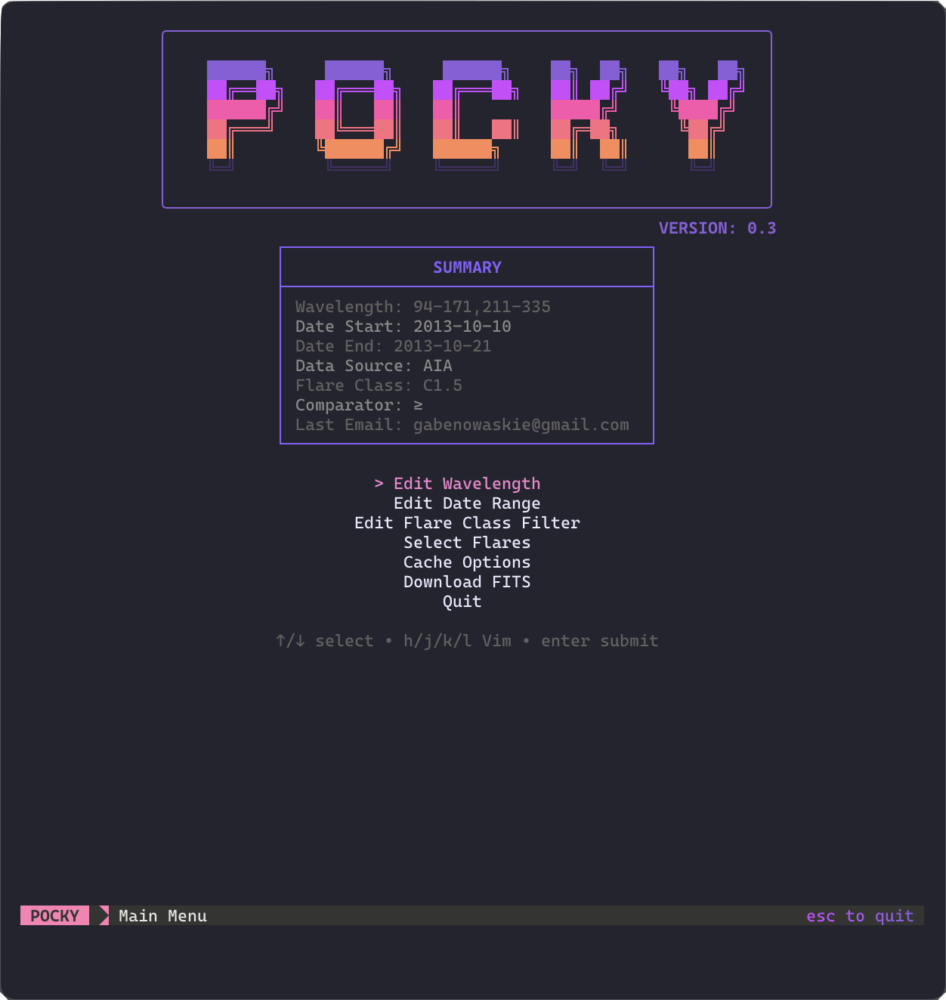

<div align="center">

[](https://github.com/Gnowak73/Pocky/releases)
[](https://github.com/Gnowak73/Pocky/actions)
[](LICENSE)

</div>

<div align="center">
  
</div>

Pocky is a Go TUI for building flare queries, downloading FITS data, and analyzing data via
machine learning and Fourier analysis.

It is recommended to use Ghostty or a customizable terminal for glamour, but it is not technically required.

There is a minimal bash version and a full Go version of the program.
The bash file is `pocky.sh` in the main directory. The compiled Go files are in `TUI-go/` as
`pocky-macos`, `pocky-linux`, and `pocky.exe`. All can be executed with `./` after they are given
sufficient permissions. All Go executables should run out of the box.

NOTE: please note any issues via private message or an issue request.

<hr/>
### Bash Executable Setup

Some GNU coreutils are needed: `date -d`, `awk`, GNU `sed`, and GNU `grep`. If you are on a Linux system with
Bash >= 4.0, you are already set. If you are on some other Unix-based system like macOS, you need to obtain
these tools and have them work in the exact same way.

An example for macOS can be found at
https://smallsharpsoftwaretools.com/tutorials/gnu-mac/. These functions are installed and then added
to our PATH to override the native commands. On macOS, this seems to only be with date/gnu-date,
sed/gnu-sed, and grep/gnu-grep.

Additionally, there are some external CLI (Command Line Interface) packages used: `tte` and `gum`.

tte, or terminal text effects, renders animations of strings in the TUI (Terminal UI). See
https://github.com/ChrisBuilds/terminaltexteffects. This is most easily downloaded on Arch Linux with
`yay`. For all other systems, using `pip` or `pipx` seems to be the easiest:

```bash
# pipx
pipx install terminaltexteffects

# pip
pip install terminaltexteffects
```


Gum is a part of the charm library: https://github.com/charmbracelet/gum. It is used to prompt
the user in the TUI and record input data. To download it via package manager:
```bash

# Linux/ MacOS
brew install gum

# Arch Linux
pacman -S gum

# Windows (Winget or Scoop)
winget install charmbracelet.gum
scoop install charm-gum
```

<hr/>
### Go Executables Setup

The Go executables are the recommended executable to run, as they automatically download needed packages
and work much more smoothly. If there are any problems launching an executable as-is, you may recompile
it with:

```bash
go build -o [name] ./cmd/pocky
```

where you input the executable name into `[name]`. This requires a recent Go install for compiling.
See https://go.dev/doc/install. In the case of any recompiles or the use of the bash version, users may
need to grant execute permissions via `chmod +x`.

### Python Setup

To run the parts of the program which run Python files for data analysis, server querying, or downloading FITS,
you must have the latest version of Python downloaded. It is heavily recommended to use `conda` to set up a Python
environment. See https://www.anaconda.com/docs/getting-started/miniconda/install. This way, all downloaded packages
can be easily maintained without downloading things globally to your entire system.

Python is called in the program via `python`. For Windows (if you added Python to PATH) and sometimes Linux,
the `python` command works to call Python 3. However, in many cases, `py` (Windows) and `python3` (Linux/macOS)
are the Python 3 commands. For Windows, make sure to enable "add python to PATH" during installation.

For Unix-based systems like Linux and macOS, we add a symlink from `python3` to `python`. This just masks
the `python` command as `python3`. Make sure that Python 2 is NOT installed if you do this, as the `python`
command typically calls Python 2 and can cause overlaps. We use:

```bash
ln -s python3 "$(dirname "$(which python3)")/python"
```

Once this is finished, typing `python` in a terminal should do the same thing as the `python3` command.

### Python Packages

Once you have made a conda env, you need these packages:

- `astropy`
- `drms`
- `parfive`
- `sunpy`

Install them with `conda install`, or use `conda install pip` and then `pip install`.

<hr/>
### Controls
Pocky is fully keyboard-driven, but also supports mouse hover, scrolling, and clicks. General
controls for each menu are shown in hints at the bottom.

- arrow keys and Vim controls move through menus.
- `enter` selects or confirms the current item.
- `esc` or `q` goes back or cancels a screen.
- Mouse wheel scrolls in tables and viewports.
- Left click selects items and changes focus.
- If mouse input does not register, try right clicking to give the terminal focus.
  Some terminals only start sending mouse tracking events after a focus action,
  and right click is the quickest way to force that without changing selection.

